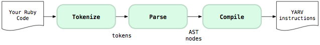
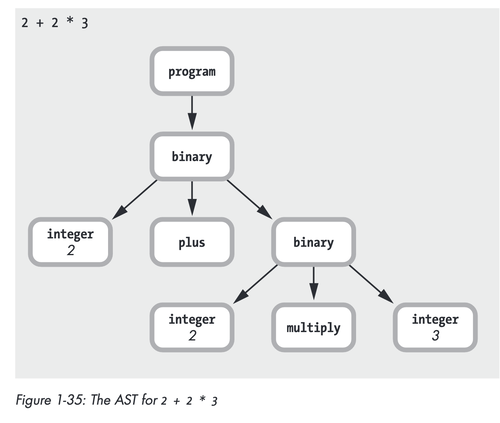
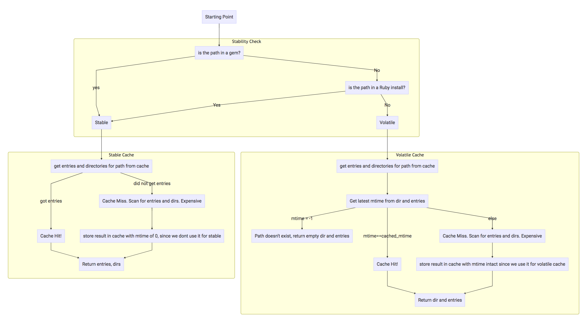
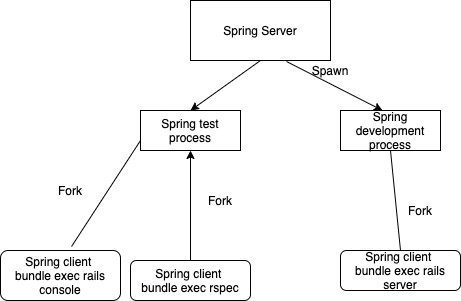

## Behind the scenes of Bootsnap

---

## Aboobacker MK

### Software Engineer 👨‍💻

---

## Life of a ruby program

---

```
$ ruby program.rb
```
---
### Lot of steps 🪜



---

### Let's rip them apart 🔪
```ruby
require 'ripper'
require 'pp'
code = <<CODE
def add(x, y)
  x + y
end
CODE
```

---

### Tokenization
```ruby
irb(main):043:0> Ripper.tokenize code
=> ["def", " ", "add", "(", "x", ",", " ", "y", ")", "\n", "x", " ", "+", " ", "y", "\n", "end", "\n"]
```
---
### Parsing 

```ruby
irb(main):042:0> pp Ripper.sexp(code)
[:program,
 [[:def,
   [:@ident, "add", [1, 4]],
   [:paren,
    [:params,
     [[:@ident, "x", [1, 8]], [:@ident, "y", [1, 11]]],
     nil,
     nil,
     nil,
     nil,
     nil,
     nil]],
   [:bodystmt,
    [[:binary,
      [:var_ref, [:@ident, "x", [2, 0]]],
      :+,
      [:var_ref, [:@ident, "y", [2, 4]]]]],
    nil,
    nil,
```
---
### Abstract Syntax Tree


Ref: Ruby Under a microscope

---
### Compile to YARV
```
irb(main):052:0> puts RubyVM::InstructionSequence.compile(code).disasm
== disasm: #<ISeq:<compiled>@<compiled>:1 (1,0)-(3,3)> (catch: FALSE)
0000 definemethod                           :add, add                 (   1)[Li]
0003 putobject                              :add
0005 leave

== disasm: #<ISeq:add@<compiled>:1 (1,0)-(3,3)> (catch: FALSE)
local table (size: 2, argc: 2 [opts: 0, rest: -1, post: 0, block: -1, kw: -1@-1, kwrest: -1])
[ 2] x@0<Arg>   [ 1] y@1<Arg>
0000 getlocal_WC_0                          x@0                       (   2)[LiCa]
0002 getlocal_WC_0                          y@1
0004 opt_plus                               <calldata!mid:+, argc:1, ARGS_SIMPLE>
0006 leave                                                            (   3)[Re]
=> nil
```
---
### Can we run ruby program from the binary 🧐

```bash
➜ cat example.rb
number = 23
puts number + 23
➜ ruby -e "File.write('example.bin', 
RubyVM::InstructionSequence.compile_file('example.rb')
.to_binary)"
➜ cat example.bin
YARB@
     �x86_64-darwin18%�#�%�gw
numberE+Eexampleputs���������%
```
---
### Here it is 🔥

```ruby
irb(main):018:0>  RubyVM::InstructionSequence.
load_from_binary(File.read('example.bin')).eval
46
```
---
- Machine dependent, can't transfer

<!-- Programatically load

Read Iseq from files

bootsnap and yumiomu

Instruction elimination -->

---
Let's talk about `require`

```ruby
def require(file_name)
  eval File.read(filename)
end
```
---

- What if we require twice? 
---

### Keep track of require 📒

```ruby
  $LOADED_FEATURES = []
  def require(filename)
    return false if $LOADED_FEATURES.include?(filename)
    eval File.read(filename)
    $LOADED_FEATURES << filename
  end
```
---
#### Absolute paths only ?

---
### Look everywhere 🕵️‍♂️
```ruby
  $LOAD_PATH = []

  def require(filename)
    full_path = $LOAD_PATH.take do |path|
      File.exist?(File.join(path, filename))
    end

    eval File.read(full_path)
  end
```
---

### Luxola stats 📊
```bash
irb(main):054:0>  $LOADED_FEATURES.count
=> 6552
```

```ruby
irb(main):058:0> $LOAD_PATH.count
=> 779
```
---
### Redundant io operations
---
## Bootsnap 🔥

- Path Pre-Scanning <!-- .element: class="fragment" data-fragment-index="1" -->
- compilation Caching <!-- .element: class="fragment" data-fragment-index="2" -->
---
### Path prescanning

- Kernel#require and Kernel#load are modified to eliminate $LOAD_PATH scans <!-- .element: class="fragment" data-fragment-index="1" -->
- ActiveSupport::Dependencies.{autoloadable_module?,load_missing_constant,depend_on} are overridden to eliminate scans of ActiveSupport::Dependencies.autoload_paths. <!-- .element: class="fragment" data-fragment-index="2" -->

---

### Compilation Caching

- RubyVM::InstructionSequence.load_iseq is implemented to cache the result of Ruby bytecode compilation <!-- .element: class="fragment" data-fragment-index="1" -->
- YAML.load_file is modified to cache the result of loading a YAML object in MessagePack format (or Marshal, if the message uses types unsupported by MessagePack) <!-- .element: class="fragment" data-fragment-index="2" -->
---

---

## PATH prescanning
$LOAD_PATH = [app, lib, gem1/lib]

```
open app/foo.rb # (fail)
# (imagine this with 500 $LOAD_PATH entries instead of three)
open lib/foo.rb # (success)
close lib/foo.rb
open lib/foo.rb
```

---
```ruby
 def require(filename)
    if $CACHED_PATH[file_name]
      full_path = $CACHED_PATH[filename]
    else
      full_path = $LOAD_PATH.take do |path|
        File.exist?(File.join(path, filename))
      end
    end

    eval File.read(full_path)
 end
```
---
ActiveSupport::Dependencies.autoload_paths
---

## Cache Invalidation

- Stable (Ruby installation path and Gem path)
- Volatile (Everything else)
---
## Caching LoadErrors

---

---

### Compilation Caching
```ruby
module InstructionSequenceMixin
    def load_iseq(path)
      # Having coverage enabled prevents iseq dumping/loading.
      return nil if defined?(Coverage) && Bootsnap::CompileCache::Native.coverage_running?

      Bootsnap::CompileCache::ISeq.fetch(path.to_s)
    rescue Errno::EACCES
      Bootsnap::CompileCache.permission_error(path)
    rescue RuntimeError => e
      if e.message =~ /unmatched platform/
        puts("unmatched platform for file #{path}")
      end
      raise
    end
  end
```
---
```ruby
def self.fetch(path, cache_dir: ISeq.cache_dir)
  Bootsnap::CompileCache::Native.fetch(
    cache_dir,
    path.to_s,
    Bootsnap::CompileCache::ISeq,
    nil,
  )
end
```
---
### Result

Before:	29.772s
After: 20.115s

---
### What about spring then ? 🤨

---

- Spring is a rails only tool <!-- .element: class="fragment" data-fragment-index="1" -->
- Only for development and test environments <!-- .element: class="fragment" data-fragment-index="2" -->
---



---
https://github.com/rails/spring/blob/577cf01f232bb6dbd0ade7df2df2ac209697e741/lib/spring/application.rb#L150
---

```ruby [5-6|10|13|16-18|20-21|28-35|37-38|40-44|60|63]
 def serve(client)
      log "got client"
      manager.puts

      _stdout, stderr, _stdin = streams = 3.times.map { client.recv_io }
      [STDOUT, STDERR, STDIN].zip(streams).each { |a, b| a.reopen(b) }

      preload unless preloaded?

      args, env = JSON.load(client.read(client.gets.to_i)).values_at("args", "env")
      command   = Spring.command(args.shift)

      connect_database
      setup command

      if Rails.application.reloaders.any?(&:updated?)
        Rails.application.reloader.reload!
      end

      pid = fork {
        Process.setsid
        IGNORE_SIGNALS.each { |sig| trap(sig, "DEFAULT") }
        trap("TERM", "DEFAULT")

        unless Spring.quiet
          STDERR.puts "Running via Spring preloader in process #{Process.pid}"

          if Rails.env.production?
            STDERR.puts "WARNING: Spring is running in production. To fix "         \
                        "this make sure the spring gem is only present "            \
                        "in `development` and `test` groups in your Gemfile "       \
                        "and make sure you always use "                             \
                        "`bundle install --without development test` in production"
          end
        end

        ARGV.replace(args)
        $0 = command.exec_name

        # Delete all env vars which are unchanged from before Spring started
        original_env.each { |k, v| ENV.delete k if ENV[k] == v }

        # Load in the current env vars, except those which *were* changed when Spring started
        env.each { |k, v| ENV[k] ||= v }

        # requiring is faster, so if config.cache_classes was true in
        # the environment's config file, then we can respect that from
        # here on as we no longer need constant reloading.
        if @original_cache_classes
          ActiveSupport::Dependencies.mechanism = :require
          Rails.application.config.cache_classes = true
        end

        connect_database
        srand

        invoke_after_fork_callbacks
        shush_backtraces

        command.call
      }

      disconnect_database

      log "forked #{pid}"
      manager.puts pid

      wait pid, streams, client
    rescue Exception => e
      log "exception: #{e}"
      manager.puts unless pid

      if streams && !e.is_a?(SystemExit)
        print_exception(stderr, e)
        streams.each(&:close)
      end

      client.puts(1) if pid
      client.close
    ensure
      # Redirect STDOUT and STDERR to prevent from keeping the original FDs
      # (i.e. to prevent `spring rake -T | grep db` from hanging forever),
      # even when exception is raised before forking (i.e. preloading).
      reset_streams
    end
```
---
### Why are we getting weired errors then ?
---
    There are only two hard things in Computer Science: cache invalidation and naming things.

    -- Phil Karlton

---
## Questions ? 🙋‍♂️